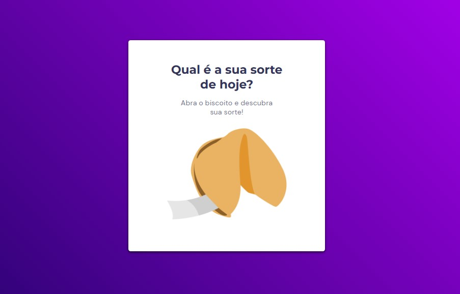

<h1 align="center"> Biscoito da Sorte </h1>

Um jeito legal de refletir sobre seu dia, testando sua sorte em pequenas frases de reflexão!   

  <a href="#-tecnologias">Tecnologias</a>&nbsp;&nbsp;&nbsp;|&nbsp;&nbsp;&nbsp;
  <a href="#-projeto">Projeto</a>&nbsp;&nbsp;&nbsp;|&nbsp;&nbsp;&nbsp;
  <a href="#-layout">Layout</a>&nbsp;&nbsp;&nbsp;|&nbsp;&nbsp;&nbsp;
  <a href="#memo-licença">Licença</a>

  

 

  

## 🚀 Tecnologias

Esse projeto foi desenvolvido com as seguintes tecnologias:

- HTML e CSS
- JavaScript
- Git e Github
- Figma
- Desktop e Mobile

## 💻 Projeto

O Biscoito_da_Sorte  é um biscoito pequeno, crocante e açucarado feito de farinha, açúcar, baunilha, óleo de gergelim e que contém dentro dele um pedaço de papel com uma "sorte", geralmente um aforismo ou uma profecia vaga. Pode conter também um grupo de números que são utilizados por alguns como números de loteria. É um agregador de linhas de texto para reflexionar seu dia com visitas online.

- [Acesse o projeto finalizado, online](https://eknerph.github.io/biscoito-da-sorte/)

## 🔖 Layout

Você pode visualizar o layout do projeto através [DESSE LINK](https://www.figma.com/file/Jx1ikiuvMeBmTa6RSLpU3h/Biscoito-da-Sorte-(Community)?node-id=0%3A1&t=yYIILaRwrKpjI4Ty-0). É necessário ter conta no [Figma](https://figma.com) para acessá-lo.

## :memo: Licença

Esse projeto está sob a licença EAA.

---

Feito com ♥ :wave: [Linkedin](https://www.linkedin.com/in/ekner-alexandre/)
